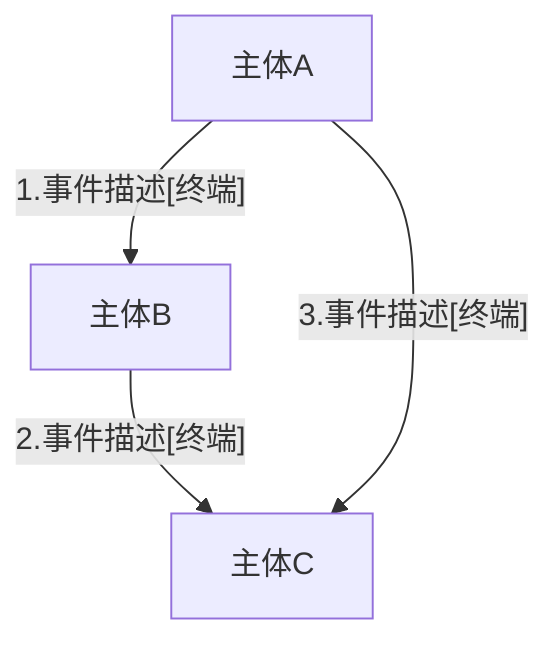
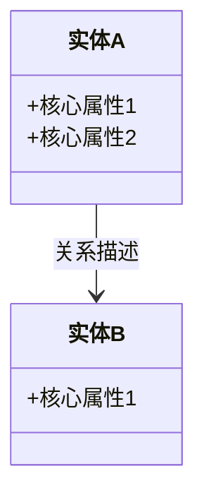
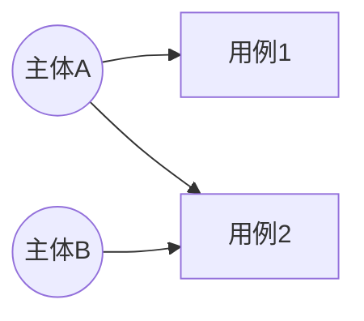

# L2 产出格式模板

## 文件一：02-目的边界/index.md

### 标准格式

```markdown
# 目的边界

## 约束摘要（供下层快速引用）
- 核心边界：[做什么的一句概括] / [不做什么的一句概括]
- 终端架构：[哪几个终端，各自定位]
- 业务闭环：[核心链路的一句话概括]
- 强制回溯：终端分工表、"不做什么"表（下游必须全文读取）

## 主体链接图



### 主体说明
| 主体 | 说明 |
|------|------|
| [主体A] | [角色描述] |
| [主体B] | [角色描述] |

## 终端分工表

| 主体 | 终端类型 | 能力边界 |
|------|---------|---------|
| [主体] | [终端类型] | [能力描述] |

## 终端场景清单

| 终端 | 事件序列 | 涉及主体 | 定位 |
|------|---------|---------|------|
| [终端名] | [序号.事件 → 序号.事件 → ...] | [主体列表] | [定位描述] |

## 边界表

### 做什么（纳入系统）
| 事件 | 原因 |
|------|------|
| [事件描述] | [纳入原因] |

### 不做什么（不纳入系统）
| 事件 | 原因 |
|------|------|
| [事件描述] | [不纳入原因] |

## 类图初版



## 用例图初版



## 产品上下文·扩展

### L1 种子
（从 01-业务目的/index.md 的约束摘要继承）

### L2 扩展
- 做什么：[一句话概括]
- 不做什么：[一句话概括]
- 终端架构：[终端类型列表 + 各自定位]
- 业务闭环：[核心链路]
```

### 字段说明

| 字段 | 要求 | 常见错误 |
|------|------|----------|
| 约束摘要 | 控制在 200 字以内，突出边界和终端 | 太详细或缺少终端信息 |
| 主体链接图 | Mermaid graph，所有事件有终端标注 | 遗漏终端标注或序号不连续 |
| 终端分工表 | 每个主体-终端对有能力边界描述 | 只有终端名没有能力边界 |
| 终端场景清单 | 每个终端的事件序列按序号排列 | 事件遗漏或序号错乱 |
| 边界表 | 每条事件有判定+原因 | 只有"纳入"没有"不纳入"，或原因空泛 |
| 类图初版 | 实体名+核心属性+关系 | 太详细（完整字段）或太简略（只有实体名） |
| 用例图初版 | Actor+用例+系统边界 | 缺少终端约束信息 |

### 约束摘要写作规则

- 核心边界：从边界表提炼，用"做什么/不做什么"的对比句
- 终端架构：从终端分工表提炼，列出终端类型+定位
- 业务闭环：从主体链接图提炼核心链路
- 强制回溯：固定为"终端分工表、不做什么表"，这是下游必须全文回溯的内容

---

## 文件二：02-目的边界/CLAUDE.md

### 标准格式

```markdown
# L2 约束摘要
{200字以内：关键边界、终端架构、业务模型要点}

## ⚠️ 强制回溯项（下游必须全文读取，不能只读摘要）
- 终端分工表（L3/L4/L5 都必须回溯）
- "不做什么"表（每一条都要看到）
- 终端场景清单（L4 按终端拆场景的依据）

## 下游须知
- 终端架构：{哪几个终端，各自能力边界}
- 业务闭环：{核心链路}
- 类图初版位置：02-目的边界/index.md 的"类图初版"章节
- 用例图初版位置：02-目的边界/index.md 的"用例图初版"章节
```

### 编写规则

| 字段 | 规则 |
|------|------|
| 约束摘要 | 从 index.md 的约束摘要章节提取，200 字以内 |
| 强制回溯项 | 固定包含：终端分工表、"不做什么"表、终端场景清单 |
| 下游须知 | 列出 L3/L4/L5 必须注意的终端架构、业务闭环、模型位置 |
