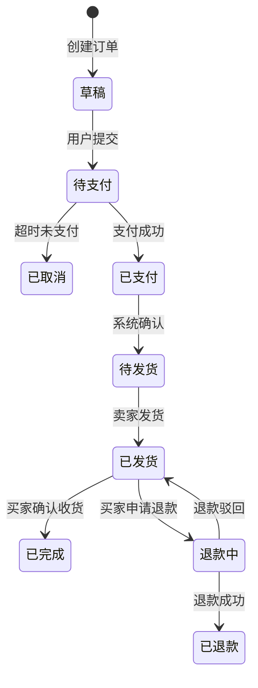

# L5 方法论精华

## 核心方法：四步法（场景分析→能力抽象→模块设计→功能点细化）

L5 的核心不是 1:1 的场景→功能映射，而是通过四步法，从场景中抽取可复用的系统能力。

### 四步流程

| 步骤 | 说明 | 输入 | 输出 |
|------|------|------|------|
| 1. 场景分析 | 汇集本终端所有 L4 场景中的 🔴 系统接触点 | L4 scenario 文件 | 能力需求列表 |
| 2. 能力抽象 | 将接触点抽象为可复用的能力 | 能力需求列表 | 抽象能力清单（标注复用场景） |
| 3. 模块设计 | 按高内聚低耦合原则组织模块 | 抽象能力清单 | 模块划分 + 隐喻描述 |
| 4. 功能点细化 | 每个功能拆到具体说明 | 模块划分 | 功能点 + 限制/策略/要点 |

### 正例 vs 反例

**❌ 反例：1:1 映射（场景 A → 功能 A，场景 B → 功能 B）**

```
场景：用户咨询价格 → 功能：价格咨询
场景：用户查询地址 → 功能：地址查询
场景：用户预约挂号 → 功能：预约挂号
问题：三个功能都需要"识别用户意图"，重复开发
```

**✅ 正例：四步法抽象**

```
步骤1 场景分析：
  场景A接触点：识别价格意图 → 检索价格信息 → 返回价格数据
  场景B接触点：识别地址意图 → 检索地址信息 → 返回地址数据
  场景C接触点：识别预约意图 → 检索排班信息 → 发起预约

步骤2 能力抽象：
  意图识别 ← 场景A/B/C 共同需要（复用）
  知识库检索 ← 场景A/B/C 共同需要（复用）
  预约管理 ← 只有场景C需要（独立）

步骤3 模块设计：
  认知模块（大脑）：意图识别、风控判断
  知识模块（记忆）：知识库检索
  任务模块（行动）：预约管理

步骤4 功能点细化：
  C1. 意图识别
    - 功能点：文本意图分类、敏感词检测
    - 限制：置信度 < 0.7 时转入人工
    - 策略：使用 LLM 做 zero-shot 分类
```

### 注意事项

- 四步法是**收敛过程**：步骤1最发散（穷举接触点），步骤4最收敛（具体说明）
- 抽象的粒度是经验判断——太粗看不清差异，太细失去复用价值
- 每个能力都要标注被哪些场景复用，这是验证高内聚低耦合的依据

---

## 核心方法：高内聚低耦合

### 高内聚

相关的功能应该放在一起。

| 判断标准 | 高内聚（✅） | 低内聚（❌） |
|----------|------------|------------|
| 模块内功能是否相关？ | 消息读取 + 视觉巡逻 + 信息提取 | 消息读取 + 文案生成 + 价格计算 |
| 修改一个功能是否影响其他？ | 修改消息读取不影响其他 | 修改价格计算导致消息读取出错 |
| 能否独立理解模块职责？ | "感知模块负责获取外部信息" | "这个模块负责读取+生成+计算" |

### 低耦合

模块之间的依赖应该最小化。

| 判断标准 | 低耦合（✅） | 高耦合（❌） |
|----------|------------|------------|
| 模块间交互方式？ | 通过接口交互 | 直接调用具体实现 |
| 修改一个模块是否影响其他？ | 修改认知模块不影响感知模块 | 修改风控逻辑导致执行器崩溃 |
| 能否替换模块实现？ | 可以替换 RAG 引擎实现 | 风控逻辑硬编码在执行器中 |

### 模块依赖关系图画法

```
输入层 → 处理层 → 输出层
  ↓         ↓         ↑
感知     认知+决策    执行
```

关键：画出模块间的数据流方向和接口标注。

---

## 核心方法：模块编号与隐喻描述

### 编号规范

每个模块一个前缀字母 + 序号。前缀由模块职责的首字母或缩写决定。

| 前缀示例 | 模块职责 | 说明 |
|----------|---------|------|
| P1, P2, P3 | Perception（感知） | 与外部系统交互的能力 |
| C1, C2 | Cognition（认知） | 判断、决策能力 |
| K1, K2 | Knowledge（知识） | 知识管理能力 |
| I1 | Infrastructure（基础设施） | 运行支撑能力 |

**规则**：前缀保证跨文档引用的一致性。同一模块的功能统一前缀。

### 隐喻描述

每个模块写一句隐喻式责任描述，让非技术人员秒懂：

| 隐喻 | 模块 | 职责 |
|------|------|------|
| 系统的手和眼 | 感知与控制模块 | 与外部系统的物理交互 |
| 系统的大脑 | 决策与认知模块 | 处理逻辑和判断 |
| 系统的记忆 | 知识与任务管理模块 | 存储和检索知识 |
| 系统的支撑 | 基础设施模块 | 运行环境保障 |

**注意**：隐喻是辅助理解，不是替代技术描述。每个模块既要有隐喻，也要有技术职责说明。

---

## 核心方法：功能架构图画法

### 格式要求

1. **分层排列**：输入层 → 处理层 → 输出层（从上到下或从左到右）
2. **带标签的数据流箭头**：标注数据类型（如 `--Task-->`, `--RAG-->`, `--Text-->`）
3. **标注外部系统交互**：运营端/后台、执行端/客户端

### 示例

```
         [运营端/后台]              [核心逻辑]                    [执行端]
  +------------------+          +---------------------+         +----------------+
  |   任务配置       | --Task-->| C1. Prompt引擎      | --Text-->| P3. 拟人执行器  |
  | (本周推销X)      |          | (融合画像+知识+任务)|          | (打字/回车)     |
  +------------------+          +---------------------+         +-------+--------+
                                                          ^                  |
  +------------------+          +---------+-----------+           v
  |   知识库管理     | --RAG--->| C2. 风控网关        |    <-------| P1. 视觉巡逻   |
  | (价目/医嘱)      |          | (敏感词过滤)       |           | P2. 信息提取   |
  +------------------+          +---------------------+           +----------------+
```

### 注意事项

- 功能架构图不是系统架构图——关注功能划分和数据流，不关注技术实现
- Mermaid 格式使用 `graph TB` 或 `graph LR`，配合 `subgraph` 分层
- 外部系统用方括号标注，内部模块用圆角矩形

---

## 核心方法：功能→页面映射规则

### 映射原则

页面是用户操作的载体，功能是系统能力的抽象。两者不是 1:1 关系。

| 映射模式 | 说明 | 示例 |
|----------|------|------|
| 一个模块 → 一组页面 | 模块的多个功能分布在一组相关页面中 | 订单模块 → 订单列表页 + 订单详情页 |
| 一个功能 → 跨多页 | 同一功能在不同页面展示 | "订单管理"功能分布在列表页+详情页 |
| 多个功能 → 同一页 | 一个页面承载多个功能 | 首页承载推荐+搜索+活动 |

### L4 场景→页面流程映射（四步法）

1. 从本终端的 L4 场景故事中提取交互触点
2. 按操作顺序串联为页面导航关系（Mermaid）
3. 标注每个页面入口（对应场景触发条件）
4. 每个页面节点标注：对应哪些场景的哪些触点

### 完整性校验

所有 L4 场景的系统触点都在页面流程中有对应节点。如有遗漏，补充页面或说明原因。

---

## 核心方法：spec 引用原则

### 核心原则

**spec 不重复定义领域知识，只做引用 + 页面级交互补充。**

规则定义一次（在 `models/rules/`），spec 只转译为用户可感知的交互行为。

### 引用 vs 重复定义

| 做法 | 正确性 | 示例 |
|------|--------|------|
| ✅ 引用 | spec 引用规则 ID | "本页面触发规则 R-003：库存不足时显示补货提示" |
| ❌ 重复定义 | spec 重新写规则 | "本页面判断库存是否 < 阈值，如果是则显示补货提示并锁定下单按钮..." |

### 五要素结构

每个页面 spec 包含五个要素（四个引用 + 一个补充）：

| 要素 | 说明 | 引用来源 |
|------|------|---------|
| 交互行为 | 用户能看到什么、能操作什么 | **页面级补充**（不来自上层） |
| 规则落地 | 规则在本页面的用户感知表现 | 引用 `models/rules/` 的规则 ID |
| 数据绑定 | 页面展示的实体和字段 | 引用 `models/class.md` 的实体 |
| 状态影响 | 本页面可触发的状态转换 | 引用 `models/states/` 的转换 |
| 场景回溯 | 本页面服务的场景 | 引用 L4 scenario 文件名 |

---

## 核心方法：API 推导方法

### 从页面规格出发推导 API

| 页面需求类型 | API 类型 | 推导路径 |
|-------------|---------|---------|
| 数据展示需求 | GET 接口 | 页面需要展示什么数据？从哪些实体来？ |
| 数据提交需求 | POST/PUT 接口 | 用户提交什么数据？触发什么状态转换？ |
| 状态触发需求 | 参考状态机 | 接口参数覆盖触发条件 |
| 规则执行需求 | 参考规则矩阵 | 接口返回覆盖规则判断结果 |

### 每个接口包含

| 字段 | 说明 | 引用来源 |
|------|------|---------|
| 路径 + 方法 | RESTful 风格 | 从页面操作推导 |
| 请求参数 | 输入字段 | 引用 `models/class.md` 的实体字段 |
| 响应结构 | 输出字段 | 引用 `models/class.md` 的实体字段 |
| 状态码 | 成功/失败/异常 | 引用 `models/rules/` 的规则和 `models/states/` 的状态 |
| 对应页面 | 哪个页面调用 | 引用本终端的 page-flow.md |
| 对应场景 | 哪个场景需要 | 引用 L4 scenario |

---

## 核心方法：状态机图画法

### 画法规则

1. **从类图中的实体出发**：只有有状态变化的实体才需要状态机
2. **状态转换由场景触发**：每个转换标注触发条件和触发场景
3. **覆盖异常转换**：L4 异常场景中的转换必须体现

### 格式



### 注意事项

- 状态是实体的生命周期阶段，不是页面的状态
- 每个状态转换必须有明确的触发条件
- 异常转换来自 L4 异常场景，不能遗漏

---

## 核心方法：规则矩阵编写

### 组织方式

按领域组织，每个领域一个文件。每条规则标注来源场景。

### 格式

| 规则 ID | 规则名称 | 触发条件 | 执行动作 | 来源场景 | 优先级 |
|---------|---------|---------|---------|---------|--------|
| R-001 | 敏感词拦截 | 消息包含敏感词 | 切换为草稿模式 | 高风险咨询安全着陆 | P0 |
| R-002 | 库存不足处理 | 库存 < 需求量 | 锁定下单按钮 + 通知补货 | 下单-库存不足 | P1 |

### 注意事项

- 规则 ID 全局唯一，跨终端引用
- 每条规则都有来源场景（可追溯到 L4）
- 异常场景的边界条件必须有对应规则
- 规则定义在 `models/rules/`，落地在各终端的 spec.md 中（不重复定义）

---

## 核心方法：运行闭环检查

### 概念

验证业务流程能否跑通——从输入到处理到输出的完整追踪。

### 检查方法

对每个核心实体，追踪其数据流闭环：

| 检查端 | 问题 | 通过标准 |
|--------|------|---------|
| 输入端 | 数据从哪来？触发条件是什么？输入格式是什么？ | 来源明确、触发条件清晰、格式可解析 |
| 处理端 | 处理需要什么依赖？处理逻辑是否清晰？异常如何处理？ | 依赖可获取、逻辑可理解、异常有兜底 |
| 输出端 | 输出到哪去？输出格式是什么？如何反馈结果？ | 目标明确、格式规范、反馈可达 |

### 使用时机

- **检查点 B（领域模型后）**：追踪核心实体的数据流闭环
- **检查点 C（每终端后）**：追踪每个页面的输入→处理→输出
- **检查点 D（组装前）**：追踪跨终端的数据流闭合

### 正例 vs 反例

**❌ 反例：数据流断裂**

```
终端A：创建订单 → 状态变为"待支付"
终端B：需要读取订单 → 但不知道从哪读，读什么格式
→ 输出端（终端A）和输入端（终端B）对不上
```

**✅ 正例：数据流闭合**

```
终端A：创建订单 → 写入数据库 → 状态"待支付" → API 返回 orderId
终端B：GET /orders/{orderId} → 读取订单状态 → 展示"待支付"
→ 输出端（API返回orderId）和输入端（API接收orderId）闭合
```

---

## 核心方法：价值闭环检查

### 概念

验证设计是否创造真实价值——投入产出比是否合理。

### 四维度评估

| 维度 | 检查问题 | 判断标准 |
|------|---------|---------|
| 用户价值 | 是否解决 L3 痛点？ | 每个核心痛点有对应功能 |
| 业务价值 | 是否达成 L1 目标？ | 每条验收标准有对应功能 |
| 技术价值 | 技术投入是否合理？ | 无过度设计的功能 |
| 成本价值 | 投入产出比可接受？ | 高价值低成本优先做，低价值高成本不做 |

### 价值评估框架

```
高价值 + 低成本 = 优先做（MVP 核心）
高价值 + 高成本 = 谨慎做（评估 ROI）
低价值 + 低成本 = 可选做（后续迭代）
低价值 + 高成本 = 不做（明确排除）
```

### 使用时机

- **检查点 D（组装前）**：对照 L1 验收标准和 L3 痛点列表，做全局价值评估
- 发现价值不明确的功能 → 标记为"待评估"或"后续迭代"

---

## 核心方法：回溯决策树

### 决策树

```
发现问题
    ↓
问题在哪一层？
    ↓
┌─────────────────────────────────────────┐
│ 问题在第5层（场景功能）                  │
│ → 第5层能解决吗？                        │
│   ├─ 能 → 在第5层解决                    │
│   └─ 不能 → 回溯第4层（用户场景）        │
│                                          │
│ 问题在第4层（用户场景）                  │
│ → 第4层能解决吗？                        │
│   ├─ 能 → 调整场景，重新推导第5层        │
│   └─ 不能 → 回溯第3层（边界用户）        │
│                                          │
│ ...逐层向上                              │
└─────────────────────────────────────────┘
```

### 回溯原则

| 原则 | 说明 |
|------|------|
| 找根因 | 不只解决表面问题，回溯到问题根源所在层 |
| 最小化调整 | 只调整必要的部分，避免大面积返工 |
| 记录决策 | 记录回溯决策，便于复盘和经验积累 |
| 双向验证 | 回溯调整后，必须重新做三维闭环验证 |

### 决策记录模板

在 plan.md 中记录每个重要决策：

```
### 决策 N：{标题}
- 触发：{是什么触发了这个决策}
- 选项：{考虑了哪些选项}
- 决策：{最终选择}
- 原因：{为什么这样选择}
- 影响：{对哪些层/阶段有影响}
```

---

## 常见误区

### 误区一：功能等于场景

❌ 错误：功能和场景一一对应
✅ 正确：一个功能可能支撑多个场景（四步法的核心价值）

### 误区二：功能粒度不当

❌ 太粗："系统有回复功能"
❌ 太细："系统有模拟字母 A 输入"、"模拟字母 B 输入"...
✅ 适中："系统有拟人化输入功能"

### 误区三：忽略功能说明

❌ 错误：只列出功能名称
✅ 正确：每个功能点都有具体说明（限制、策略、要点）

### 误区四：spec 重复定义领域知识

❌ 错误：spec.md 重新定义实体的字段结构和规则逻辑
✅ 正确：spec.md 只引用 models/ 的规则 ID + 补充页面级交互

### 误区五：状态机遗漏异常转换

❌ 错误：只画正常流程的状态转换
✅ 正确：L4 异常场景中的转换必须体现在状态机中

### 误区六：API 脱离页面规格

❌ 错误：凭"感觉"设计 API，不参考页面数据需求
✅ 正确：从页面规格的交互行为和数据绑定推导 API

---

## 追问技巧

- 用户只说"系统处理一下" → 追问："系统具体做什么？需要几秒？用户在等什么？"
- 用户说"这里有个功能" → 追问："这个功能服务于哪个场景？被几个场景复用？"
- 用户描述技术实现 → 追问："从用户视角看，这个能力解决什么问题？属于哪个模块？"
- 用户跳过异常处理 → 追问："如果出现异常（网络断、数据错、权限不足），用户看到什么？"
- 用户给功能命名虚词 → 追问："'智能优化'具体优化什么？能写测试用例吗？"
- 发现与上层矛盾 → 标记："这里和 L2 终端分工表/L3 痛点列表有冲突，是否需要回溯上层？"
- 功能点缺少具体说明 → 追问："这个功能有什么限制？采用什么策略？有什么要点需要研发注意？"
